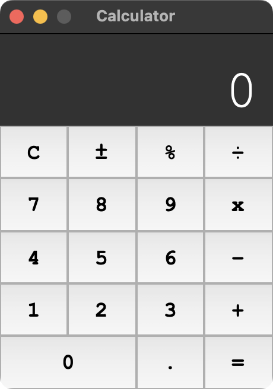

# Python GUI Calculator

A modern calculator app written in Python and built with Tkinter that runs on macOS, Windows, and Linux.

## Features
The app provides standard calculator functionality:
- Unary operations (+/-, %)
- Binary operations (+, -, *, /)
- Keyboard inputs

## Screenshot

__Note:__ This application utilizes eval() safely and prevents user
from issuing dangerous commands/functions. 

For more information, refer to
[https://lybniz2.sourceforge.net/safeeval.html](https://lybniz2.sourceforge.net/safeeval.html)

## License
Copyright (c) Jai Amin. All rights reserved.

Licensed under the [MIT License](./LICENSE).
